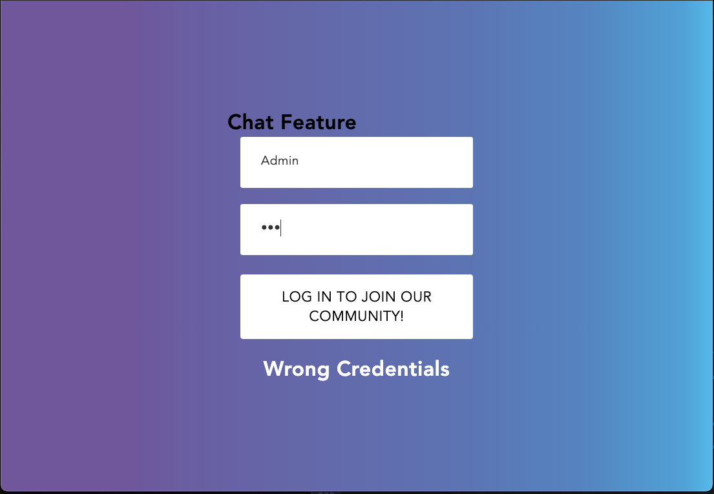
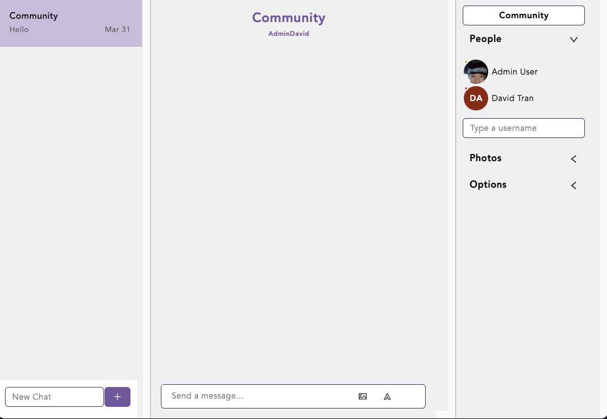

# ChatEngine

# About
A built in chat feature that can be used on any website, platform, desktop, and mobile applications. Using React-Chat-Engine library, I was able to build group chats, DMs, and send photos.

# Application Installed
-ReactJS, React Chat Engine.io,NodeJS, CSS, Bootstrap

# Image

# Future Development 
In the future, I would use this template for websites/apps that needs a chat feature and make more live.